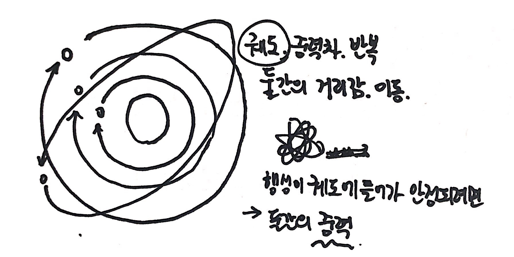

# introduction
(HyeJeoung Choi)
 
 
* Primary Works
  * Media Arts
  * (Kinectic Arts | Media Performance)  
 
* Connect links
  * **e-mail**      chjdas97@gmail.com
  * [**instagram**](https://www.instagram.com/hyejeoung2821/)   hyejeoung2821
  * [**facebook**](https://www.facebook.com/profile.php?id=100014777734057)    JEOUNEY
 
 
* Connect github : https://chjdas.github.io/PoeticCodeForNature/
 
 

 

# P5.js Works
## Retrospective / [kadenze](https://www.kadenze.com/courses/the-nature-of-code-ii/info) 
 * [kadenze 01](./work01.md/)   
 [kadenze 02](./work02.md/)  
 [ParticleSystem](./particleSystem.md/) 

  

## Main Works
 * [**Particles_bubble**](./Particles_bubble/) 
 (Click the name) 
 떨어지는 파티클에 역중력을 적용시키다가 떠오른 아이디어. 비눗방울을 불면 처음에 바람에 밀렸다가 올라가는 궤적과 마지막에 그대로 올라가는 다른 궤적들의 차이로 작품을 만들 수 있을 것같아 시도해보았다. 
 The idea of applying reverse gravity to falling particles. I tried to make the work because blowing bubbles would make the difference between a trajectory that was pushed by the wind at first and then raised at the end. 
  See Image Sketch(1-2) 
  Resources : [P5.js examples : Multiple Particle Systems](https://p5js.org/examples/simulate-multiple-particle-systems.html)   
  Seeds used for this work : particle, particleSystem(Fireworks), Gravity, wind  
   
   
 * [**The Sun, the planet**](./planet/) 
 (Click the name) 
  The planet is a different idea because it has the right structure in distance but does not go into the speed difference between the two moving.
 Perhaps because the planets were mostly made in production, the example that emerged as using the speed difference between the two objects was the planet. Therefore, we created and squeezed the following code into a virtual planet and applied.  
   The planets revolve around an ellipse based on the heaviest stars. The difference between the mass difference, the magnetic flux, and the force of gravity between the stars and the planets go through the process of being stabilized in orbit. 
   See Image Sketch(2) 
  Resources : [Example of the distance-relationship part with a mouse based on the part that calculates the distance between two objects](https://visualize.tistory.com/312) 
  Seeds used for this work : Gravity, wind  
 
 
## Sub Works
 * the principles of magnetism Worked. 
  [Mouse Interaction_Magnet](./magnet/)
  Resources : [Example of the magnetic](https://www.openprocessing.org/sketch/171308)
   
   
 * Waves, Waves Implementation Worked. 
 Resources : [I wanted to like this](https://www.youtube.com/watch?v=k3QZwO67Dy4) 
 And with this feeling, the mouse motion, the pushy pixels were not even thought of, but they wanted to have a still water resolution effect, so we decided that this would be possible with noise, which would be more natural than random values. In order to create this ripple effect with noise, I tried to weave the code that I drew in a circle above from the first. 
 [Mouse Interaction_offset](./offset/) 
 The water surface vibrates gently and gently. What will it look like when the rainwater flows and the still water moves in a curve? I tried to pixelate the water surface of a water. 
 [Surface of water](./Surface_Water) 
 See Image Sketch(1-1) 
  
  
 * Expanding the Particle System.  
  I wanted to create a fire that could be seen with a mouse, but it was difficult to create the shape of a fire, which reversed and applied the gravity of the existing particle system. 
  [Particles_seek](./particles_seek/) 
  See Image Sketch(1-1) 
   
   

## Image Sketch
 
 * (1-1) Particle Sketch img  
 
  
 * (1-2) Particle Sketch img2 - Main works (Particles_bubble)  
 
  
 * (2) The orbit of a planet  
 
