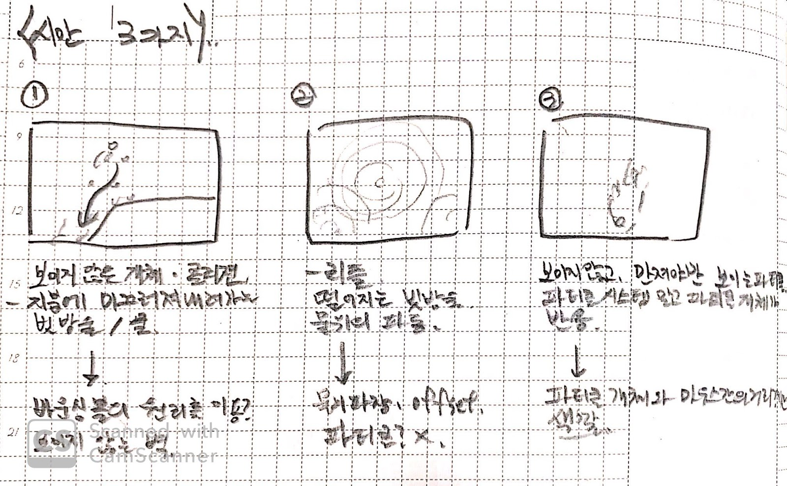
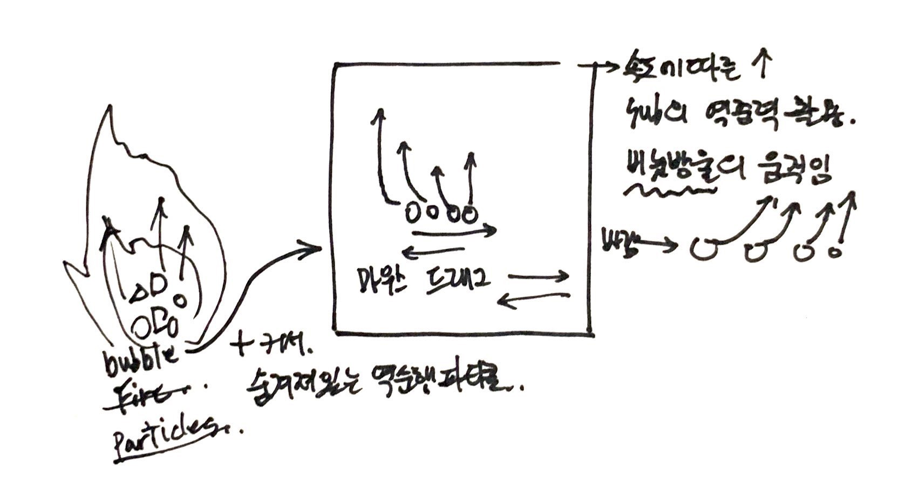

# introduction
(HyeJeoung Choi)
 
 
* Primary Works
  * Media Arts
  * (Kinectic Arts | Media Performance)  
 
* Connect links
  * **e-mail**      chjdas97@gmail.com
  * [**instagram**](https://www.instagram.com/hyejeoung2821/)   hyejeoung2821
  * [**facebook**](https://www.facebook.com/profile.php?id=100014777734057)    JEOUNEY
 
 
* Connect github : https://chjdas.github.io/PoeticCodeForNature/
 
 

 

# P5.js Works
## Retrospective
 * [kadenze](https://www.kadenze.com/courses/the-nature-of-code-ii/info) 
 [kadenze 01](./work01.md/)   
 [kadenze 02](./work02.md/)  
 [ParticleSystem](./particleSystem.md/) 

  

## Main Works
 * [**Particles_bubble**](./Particles_bubble/) 
  See Image Sketch(1-2) 
  Resources : [P5.js examples : Multiple Particle Systems](https://p5js.org/examples/simulate-multiple-particle-systems.html)  
   
 *

## Sub Works
 * the principles of magnetism Worked. 
  [Mouse Interaction_Magnet](./magnet/)
  Resources : [Example of the magnetic](https://www.openprocessing.org/sketch/171308)
   
   
 * Waves, Waves Implementation Worked. 
 [Mouse Interaction_offset](./offset/)
  
  
 * Expanding the Particle System.  
  I wanted to create a fire that could be seen with a mouse, but it was difficult to create the shape of a fire, which reversed and applied the gravity of the existing particle system. 
  [Particles_seek](./particles_seek/)
   
   
 * The Sun, the planet.  
 The planet is a different idea because it has the right structure in distance but does not go into the speed difference between the two moving.
Perhaps because the planets were mostly made in production, the example that emerged as using the speed difference between the two objects was the planet. Therefore, we created and squeezed the following code into a virtual planet and applied.  
 [The planet](./planet/)
 Resources : [Example of the distance-relationship part with a mouse based on the part that calculates the distance between two objects](https://visualize.tistory.com/312)

## Image Sketch
 
 * (1-1) Particle Sketch img  
 
  
 * (1-2) Particle Sketch img2 - Main works (Particles_bubble)  
 
