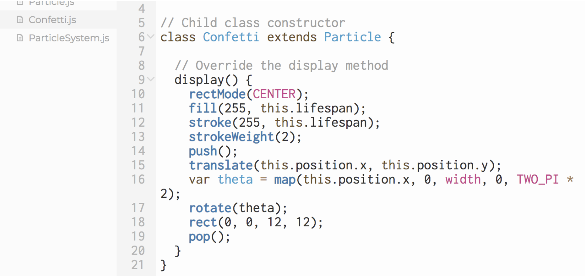
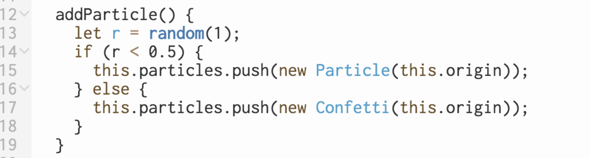
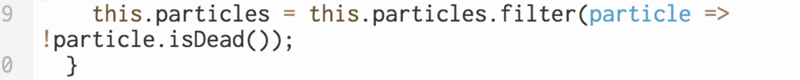
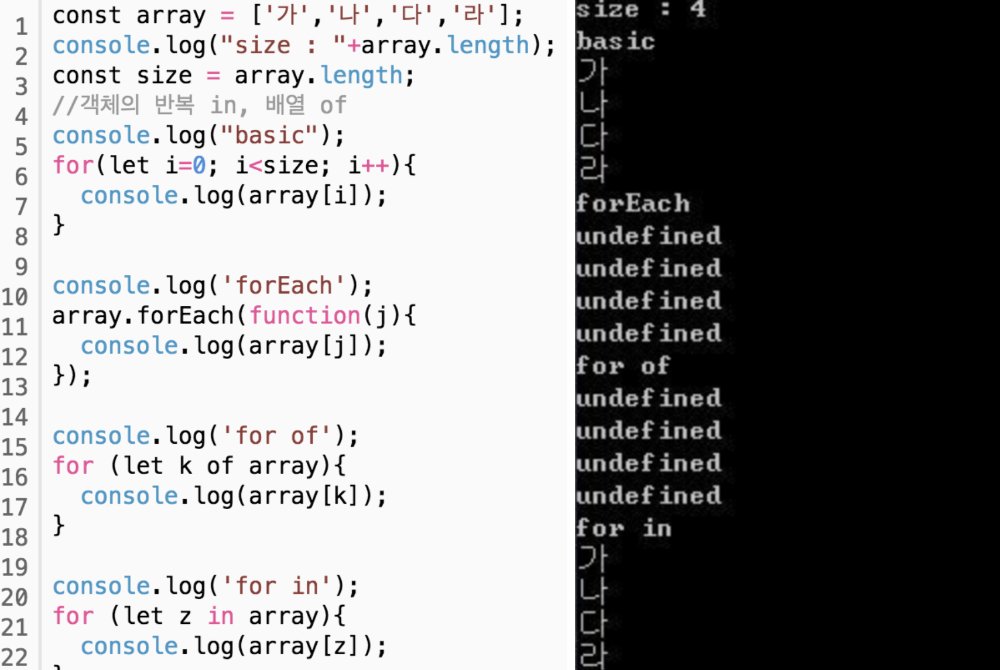

<ParticleSystem>

지금까지 배운내용 바탕 회고:
- class를 활용하여 파티클 클래스를 생성
- 속도, 가속도, 위치값을 활용한 물리법칙 적용. 벡터 이용.
- random값으로 일정 범위의 난수를 정하여 속도를 표현
- this.position = position.copy(); 로 위치값을 지정.
- lifespan이라는 깃발을 세워 일정 시간 지난 후 파티클이 사라지게 만듦.
  isDead() {
    if (this.lifespan < 0.0) {
      return true;
    } else {
      return false;
    }
  }
- 셋업에서 파티클을 불러와 실행.

배우지 않은 내용 바탕 회고:
- class의 확장 개념.
 

 
새로운 js를 만든 후 확장의 confetti를 활용하여 클래스를 확장. 해당 확장되는 것은 기존 클래스에서 추가되는 부분. 기존클래스에 영향을 주지만 원본코드는 건드리지 않게 하기위한 개념인 것인가, 덮어씌우기 생각하면 편할듯하다.
- 파티클 클래스를 아우르는 파티클 시스템 클래스 사용에 있어서
 

 
this.particles.push를 사용하여 해당 파티클을 사용하는 듯하다. 정확한 정보가 필요 ->알아볼것.
- 화살표 기호의 사용. filter?
 

 
화살표 기호에 관한 많은 정보들이 있지만 가장 이해하기 적합한 부분은 이와 같다.
 

 
filter: THRESHOLD,GRAY,OPAQUE, INVERT 등 다양한 필터를 추가할 수 있다. 필터의 인자는
filter(filterType, [filterParam])와 같다.
- 반복문 for, of?
 

 
간단하게 생각해보자. 다음과 같은 코드가 있다.
 

 
코드는 모두 다른 4개의 for문이지만 결과값이 다 다르다. basic for문과 for in 은 반복변수에 index를 리턴하지만 forEach 와 for of 는 해당 값을 리턴하기 때문이다. 결론적으로 forEach와 for of 는 배열의 반복에 사용된다.
하지만 forEach는 위와같이 callback 함수가 필요하다. 굳이 이걸 쓸 필요 없이 같은 기능을 하기 위해 나온것이 for of 인 것이다.
  
위의 사항들을 바탕으로 코드가 동작하는 방식을 생각해보자.
우선 sketch.js에서 그림을 그려줄 캔버스를 설정한다. 그 캔버스에 그릴 것은 파티클, 새로운 js를 만들고 파티클 클래스를 만든다. 파티클의 위치, 크기, 중력, 질량을 정한 뒤 벡터를 이용하여 유사하게 만든다. 해당 파티클은 일정 수치 이후엔 사라질 것이다. 파티클은 흰색의 색과 외곽선을 가지고 있지만 수치이후 사라짐에 따라 색이 연해지면 사라진다. 파티클은 원뿐만아니라 사각형도 있는데 이는 확장의 기능으로 만든다. 사각형은 돌아가는 무빙이 추가된다. 파티클 클래스와 파티클 확장클래스를 아우를 파티클 시스템 클래스를 새로 만들어 제어한다. 이는 다시 스케치 js로 불러들어와 실행될 것이다.
