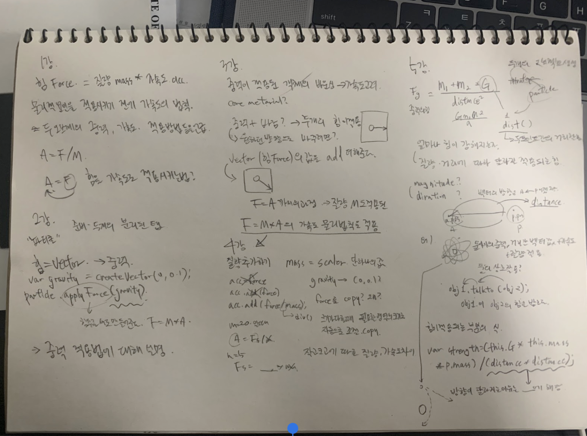
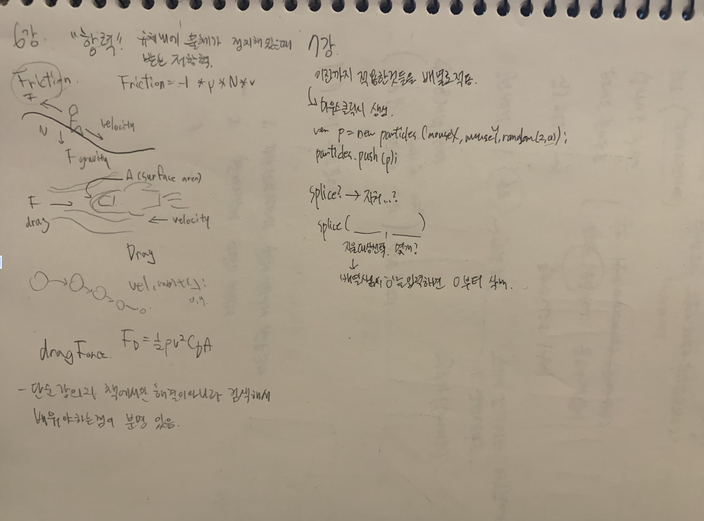

이번엔 한번 보고 타이핑으로 정리하기에는 벅찬감이 있어서 노트필기하듯이 적으며 정리하였다.
앞으로도 강의를 두번 듣는 것이 아니면 노트필기로 정리해가며 하는 것이 좋을 것같다. 한국어로 듣는다면 되새겨보고 이해할만한 부분을 영어로 들어서인지 헷갈리는 부분이 많아 10초 전버튼을 자주 누르게 되었다. 물리를 적용시키기 위한, 물리법칙들과 항력, 코드의 배경이 벡터인 점도 있지만 이번은 코드보다는 이론적인 것에 초점을 맞추고 그에 코드를 적용하는 순서적 부분에 중점이 큰 것같았다.
현재 수업전까지 여러가지 코드를 해보고자 하는 중이다.

